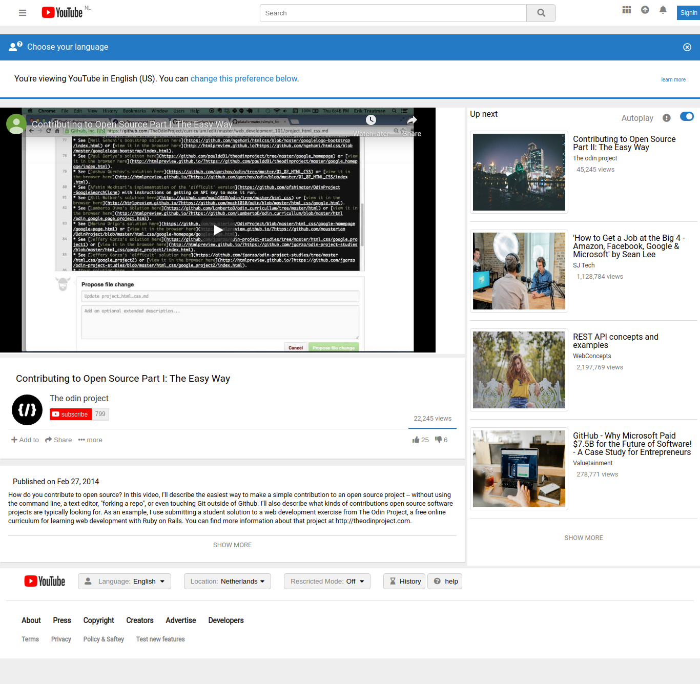

# Embedding Images and Video

> This project consists of building an HTML document that matches the appearance of youtube video player page.

Additional description about the project and its features.

## Built With

- HTML,
- CSS

## Live Demo

[Live Demo Link](https://livedemo.com)

## Getting Started

**This is an example of how you may give instructions on setting up your project locally.**
**Modify this file to match your project, remove sections that don't apply. For example: delete the testing section if the currect project doesn't require testing.**

To get a local copy up and running follow these simple example steps.

### Setup
> Clone the project into you directory and open it.

## Authors

👤 **Ignatius**

- Github: [@ignatius22](https://github.com/ignatius22)

👤 **Kedir**

- Github: [@keddo](https://github.com/keddo)
## 🤝 Contributing

Contributions, issues and feature requests are welcome!

Feel free to check the [issues page](issues/).

## Show your support

Give a ⭐️ if you like this project!

## Acknowledgments

- Hat tip to anyone whose code was used
- Inspiration
- etc

## 📝 License

This project is [MIT](lic.url) licensed.
